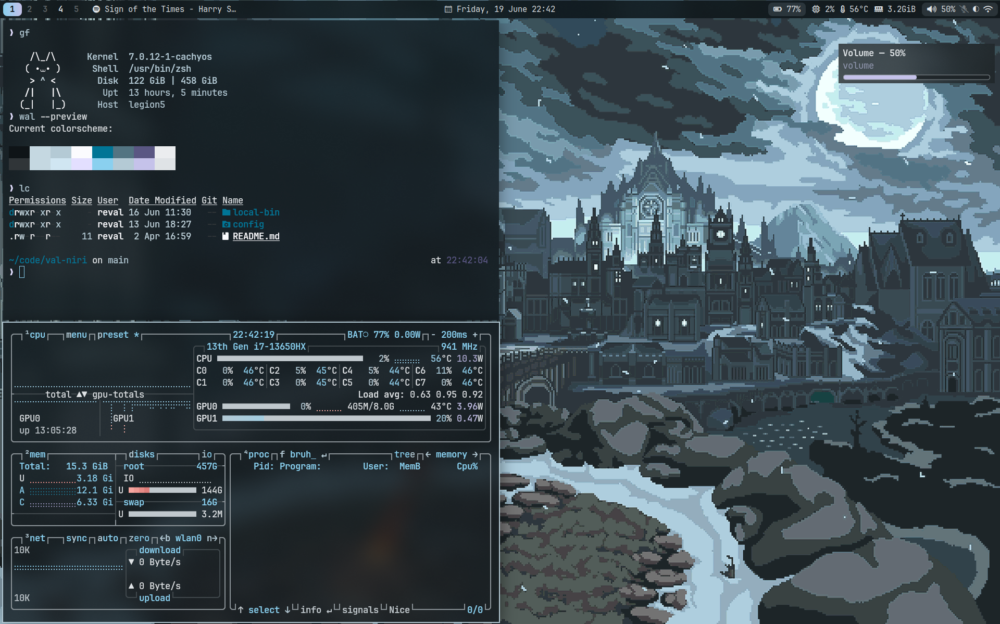
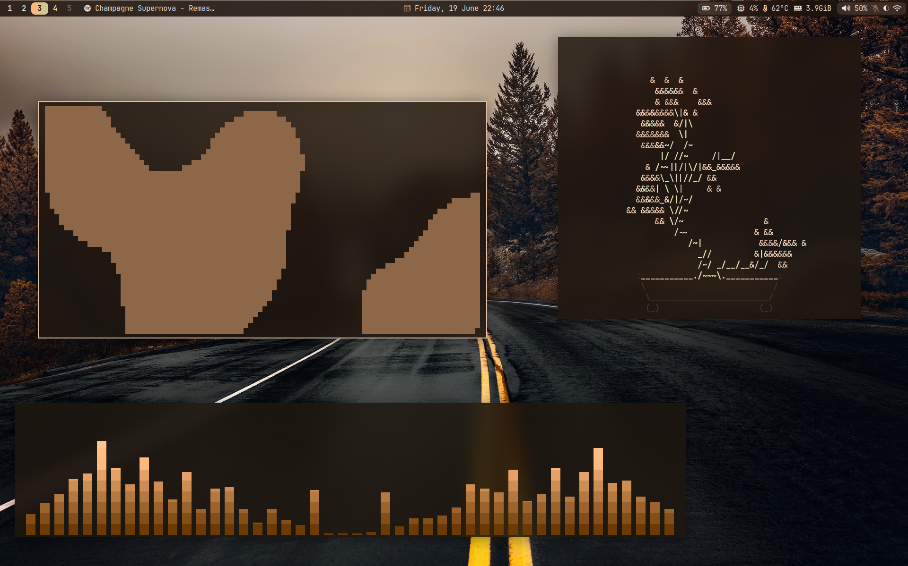
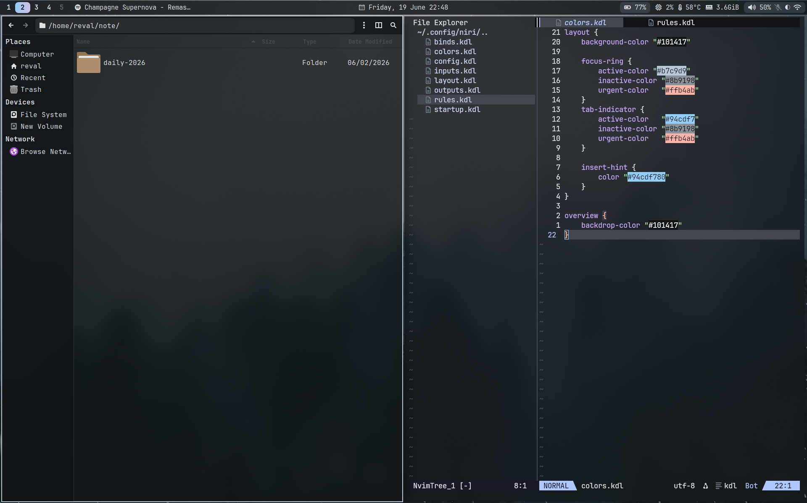
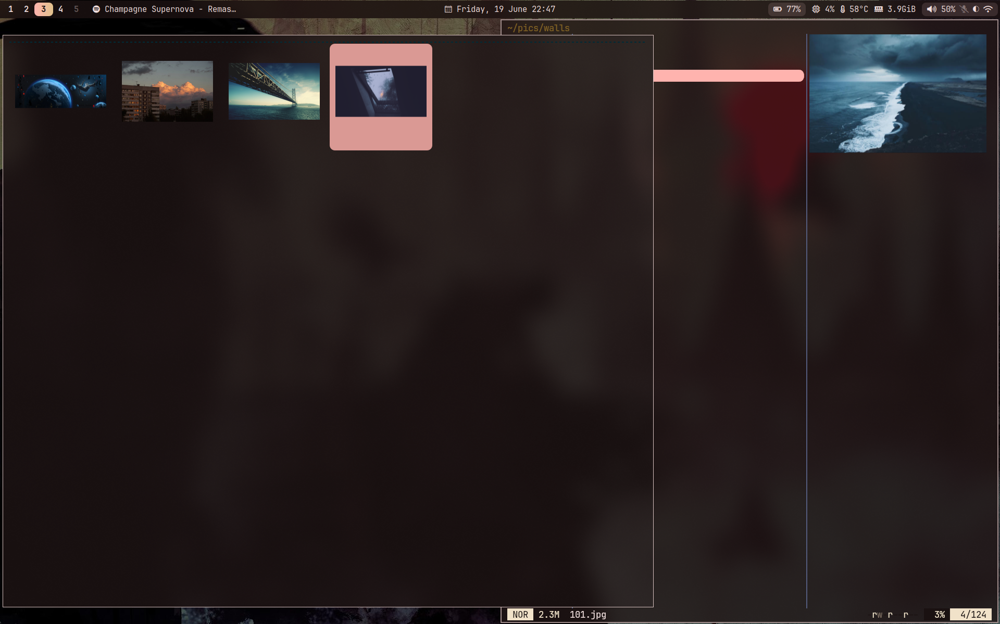
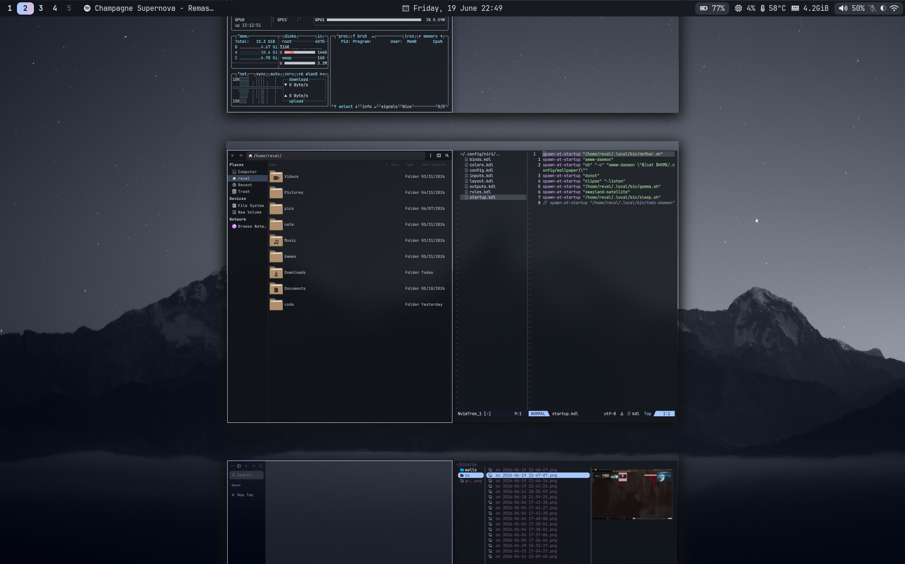

# val-niri

my niri dotfiles

i think this is pretty minimalist so you can still add stuff to yourself

+ fonts: Jetbrains mono

+ app launcher: rofi

+ fm: thunar, yazi

+ icon theme: papirus

+ terminal: kitty

+ browser: zen

+ notifications: dunst

+ editor: nvim (thanks to tony, btw for the amazing nvim config: https://github.com/tonybanters/nvim)

+ spicetify theme: text: https://github.com/darkthemer/spicetify-themes


if you wanna install:

```bash
# make sure you have fd and rofi installed btw
git clone https://github.com/revaljonathan/val-niri 
cd val-niri 
cp -r config/* ~/.config/
mkdir -p ~/.local/bin 
cp local-bin/* ~/.local/bin  
chmod +x ~/.local/bin/*
```

and just manually clone the wallpaper or cherry pick it, though my wallpaper path is ~/pics/walls in scripts so you might want to adjust that

wallpapers: https://github.com/revaljonathan/wallpapers

wttrbar binary from here: https://github.com/bjesus/wttrbar

NOTE: packs.txt is mostly used by me, you can safely delete or ignore it. That said if you decide to use it, beware that some packs is from the AUR, so be safe 🙃








